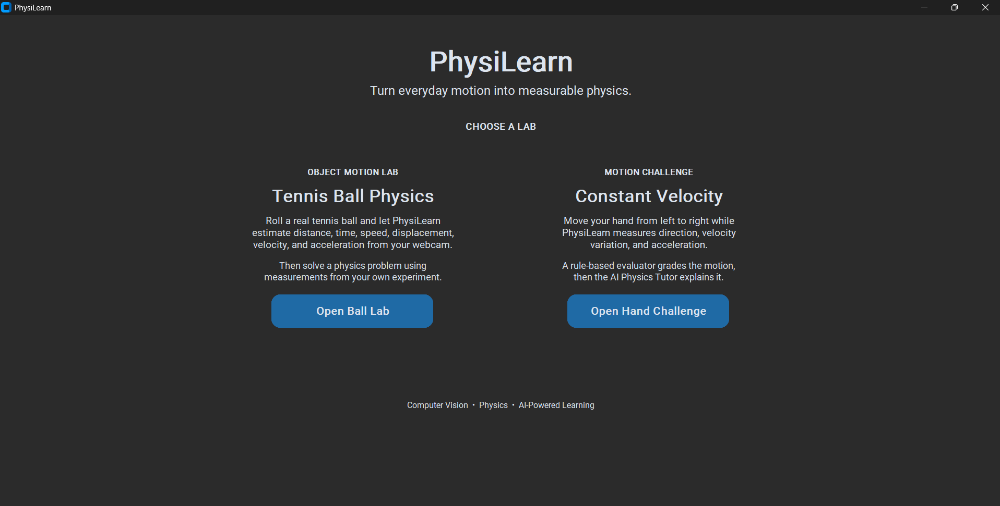
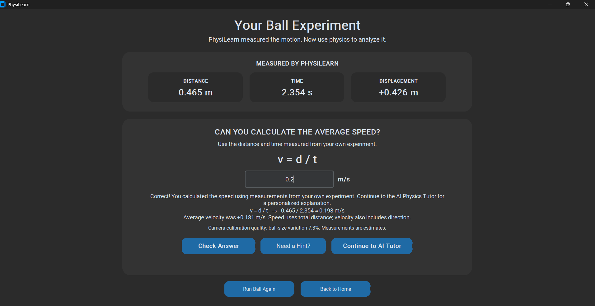
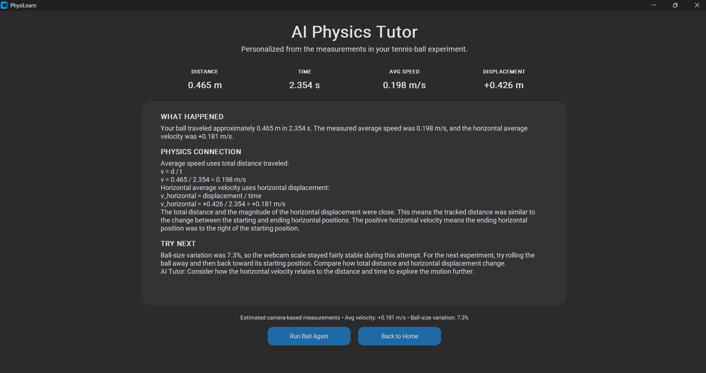
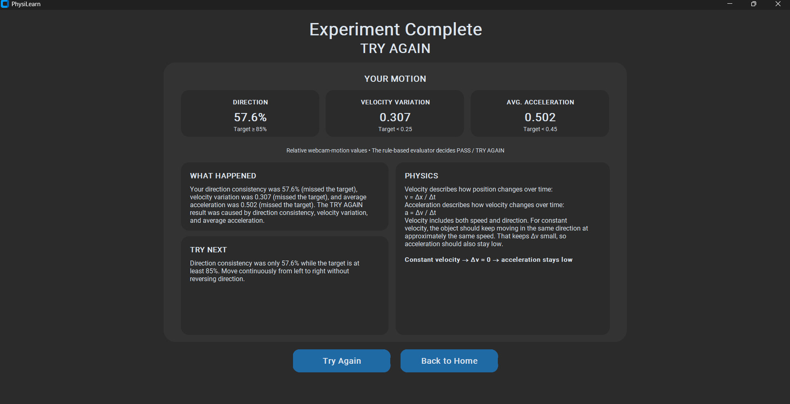

# PhysiLearn

**Turn everyday motion into measurable physics.**

PhysiLearn is an interactive webcam-based physics learning application that turns a student's own movement and real-world objects into physics experiments.

Instead of receiving fictional values from a textbook, students generate their own measurements, solve a physics problem using those measurements, and receive an explanation based on what actually happened in their experiment.

Built for the **AI + Education track at ForgeHacks 2026**.

---
## Demo Preview

### Choose a Physics Lab



### Learn From Your Own Tennis-Ball Experiment



### Personalized AI Physics Tutor



### Constant Velocity Hand Challenge



---


## Quick Start

Clone the repository and install the dependencies:

```bash
git clone https://github.com/msns4/PhysiLearn.git
cd PhysiLearn

pip install -r requirements.txt
python app.py
```

For AI-powered coaching, create a `.env` file based on `.env.example`:

```env
FEATHERLESS_API_KEY=your_featherless_api_key_here
```

The API key is **optional**.

Without a Featherless API key, PhysiLearn still runs both experiments and provides its built-in deterministic physics explanations.

---

## What PhysiLearn Does

PhysiLearn currently contains two interactive physics labs:

### 1. Tennis Ball Physics Lab

Students roll a real tennis ball across a table while PhysiLearn tracks it through the webcam.

The application estimates:

- Distance traveled
- Motion time
- Horizontal displacement
- Average speed
- Average horizontal velocity
- Velocity over time
- Acceleration over time

The student then receives a physics problem generated from their own experiment:

```text
v = d / t
```

Instead of giving the answer immediately, PhysiLearn asks the student to calculate the average speed using the measured distance and time.

After the student answers, PhysiLearn checks the result and explains the physics using the measurements from that specific experiment.

---

### 2. Constant Velocity Hand Challenge

Students move their hand from left to right while the webcam tracks the motion.

PhysiLearn analyzes:

- Direction consistency
- Velocity variation
- Average acceleration

The challenge asks the student to approximate **constant velocity**.

A deterministic evaluator decides whether the attempt is:

```text
PASS
```

or

```text
TRY AGAIN
```

The result is based on fixed motion thresholds rather than an AI model.

PhysiLearn then explains why the attempt passed or failed and gives the student a specific suggestion for the next attempt.

---

## Why PhysiLearn?

Physics is often taught using problems such as:

> A ball travels 5 meters in 2 seconds. What is its average speed?

The student can use the formula correctly without ever seeing what those numbers represent in the real world.

PhysiLearn changes the process:

```text
Real motion
    ↓
Webcam
    ↓
Computer vision
    ↓
Measured physics data
    ↓
Student solves the problem
    ↓
Physics explanation
    ↓
Personalized AI coaching
```

The student's own experiment becomes the physics problem.

This creates a stronger connection between formulas, measurements, and physical motion.

---

## Who It Helps

PhysiLearn is designed for students who want a more interactive way to understand physics concepts such as velocity, displacement, and acceleration.

It could also help:

- Schools with limited access to laboratory equipment
- Teachers who want quick hands-on demonstrations
- Students learning physics independently at home
- Visual learners who benefit from connecting formulas to real motion

A webcam, a computer, and an everyday object can become a small physics lab.

---

# How the Tennis Ball Lab Works

## 1. Ball Detection

OpenCV processes webcam frames and detects the tennis ball using color segmentation and contour analysis.

The tracker identifies the ball's approximate:

```text
x position
y position
radius
```

across video frames.

---

## 2. Webcam Calibration

PhysiLearn uses the approximate known diameter of a tennis ball:

```text
0.067 m
```

During calibration, the student holds the tennis ball still.

PhysiLearn compares the known physical diameter with the ball's apparent diameter in pixels:

```text
meters_per_pixel =
known_ball_diameter / measured_pixel_diameter
```

This provides an estimated scale for converting webcam movement into real-world distance.

---

## 3. Motion Recording

After calibration, PhysiLearn gives the student a short countdown and records the tennis ball's movement.

The program stores tracked positions over time and removes periods where the ball is approximately stationary.

---

## 4. Physics Calculations

PhysiLearn calculates quantities such as:

### Distance traveled

The tracked motion between consecutive positions is added together.

### Horizontal displacement

```text
displacement = final_x - initial_x
```

### Average speed

```text
average speed = total distance / total time
```

### Average horizontal velocity

```text
average velocity = horizontal displacement / total time
```

### Velocity and acceleration

Velocity is estimated from changes in position over time.

Acceleration is estimated from changes in velocity over time.

PhysiLearn also produces position, velocity, and acceleration graphs after the experiment.

---

## Example Ball Experiment

A real experiment might produce:

```text
Distance traveled: 0.443 m
Motion time: 3.169 s
Horizontal displacement: +0.426 m
```

The student then calculates:

```text
v = d / t

v = 0.443 / 3.169

v ≈ 0.140 m/s
```

PhysiLearn checks the student's answer and explains how average speed differs from average velocity.

---

# How the Hand Challenge Works

PhysiLearn uses the **MediaPipe Hand Landmarker** to track the student's hand through webcam frames.

The wrist landmark is used to estimate horizontal motion.

The application then calculates motion statistics such as:

```text
Direction consistency
Velocity variation
Average acceleration
```

For the current constant-velocity challenge, the targets are:

```text
Direction consistency >= 85%
Velocity variation < 0.25
Average acceleration < 0.45
```

All three targets must be satisfied for a PASS.

These measurements are relative webcam-motion values rather than laboratory-grade SI measurements.

---

# How AI Is Used

PhysiLearn deliberately separates **measurement**, **grading**, **physics logic**, and **AI coaching**.

## Hand Motion Challenge

MediaPipe detects the student's hand.

Python then calculates the motion metrics and a deterministic evaluator decides whether the result is PASS or TRY AGAIN.

Only after the result is decided can the verified measurements be sent to the AI tutor.

The AI may add a short personalized coaching message based on those measurements.

It does **not** decide the grade.

---

## Tennis Ball Physics Lab

OpenCV measures the tennis ball's motion.

Python performs the physics calculations.

The student solves the average-speed problem.

PhysiLearn checks the student's answer deterministically and generates the core physics explanation in Python.

After that, Featherless AI may provide an additional personalized coaching suggestion based on the verified experiment data.

---

## AI Model

PhysiLearn uses the Featherless API with:

```text
Qwen/Qwen2.5-7B-Instruct
```

The AI receives only verified experiment information and is used for educational coaching.

### Important design principle

**AI does not decide the measurements, grade, or physics result.**

The deterministic physics system remains authoritative.

This makes the educational feedback more reliable while still allowing the AI tutor to personalize its coaching.

---

# AI and Computer Vision Pipeline

## Tennis Ball Lab

```text
Webcam
    ↓
OpenCV tennis-ball detection
    ↓
Camera calibration
    ↓
Tracked positions over time
    ↓
Deterministic physics calculations
    ↓
Student solves v = d / t
    ↓
Deterministic answer check
    ↓
Deterministic physics explanation
    ↓
Featherless AI coaching
```

## Hand Challenge

```text
Webcam
    ↓
MediaPipe Hand Landmarker
    ↓
Tracked wrist positions
    ↓
Velocity / acceleration calculations
    ↓
Deterministic rule-based evaluator
    ↓
PASS / TRY AGAIN
    ↓
Deterministic physics explanation
    ↓
Featherless AI coaching
```

---

# Graceful AI Fallback

PhysiLearn does not require an API key to function.

If `FEATHERLESS_API_KEY` is unavailable:

```text
Computer vision still works
Physics calculations still work
Student answer checking still works
PASS / TRY AGAIN evaluation still works
Built-in physics explanations still work
```

Only the additional AI-generated coaching message is skipped.

This behavior was tested using a fresh clone of the repository without a `.env` file.

---

# Technology Stack

### Python

Main application and physics logic.

### CustomTkinter

Desktop graphical interface.

### OpenCV

Tennis-ball detection, image processing, and motion tracking.

### MediaPipe

Machine-learning-based hand landmark detection.

### NumPy

Numerical physics calculations and signal processing.

### Matplotlib

Position, velocity, and acceleration graphs.

### Featherless AI

Provides access to the Qwen2.5-7B-Instruct model for personalized educational coaching.

### python-dotenv

Loads the optional API key from `.env`.

---

# Installation

## Requirements

PhysiLearn has been tested with:

```text
Python 3.12
Windows 10 / Windows 11
Webcam
```

Clone the repository:

```bash
git clone https://github.com/msns4/PhysiLearn.git
cd PhysiLearn
```

Create a virtual environment:

```bash
python -m venv .venv
```

On Windows PowerShell:

```powershell
Set-ExecutionPolicy -Scope Process -ExecutionPolicy RemoteSigned
.\.venv\Scripts\Activate.ps1
```

Install the dependencies:

```bash
pip install -r requirements.txt
```

Optional AI configuration:

Create:

```text
.env
```

and add:

```env
FEATHERLESS_API_KEY=your_featherless_api_key_here
```

A safe example file is included:

```text
.env.example
```

The real `.env` file is excluded from Git through `.gitignore`.

---

# Running PhysiLearn

Start the main application:

```bash
python app.py
```

You will see two available labs:

```text
Tennis Ball Physics
Constant Velocity
```

Choose one and follow the instructions shown inside the application.

---

# Tennis Ball Experiment Tips

For better measurements:

- Use a yellow or green tennis ball
- Use a background without similarly colored objects
- Keep the ball clearly visible to the webcam
- Keep the tennis ball roughly the same distance from the camera
- Hold the ball still during calibration
- Roll the ball mostly left to right
- Avoid moving the camera during the experiment

PhysiLearn also reports **ball-size variation**.

A lower variation generally means the ball remained at a more consistent distance from the webcam.

---

# Project Structure

```text
PhysiLearn/
│
├── app.py
│   Main CustomTkinter application and navigation
│
├── main.py
│   Active hand-motion experiment and deterministic evaluator
│
├── ball_physics_test.py
│   Active tennis-ball tracking and physics measurement pipeline
│
├── ai_tutor.py
│   Deterministic explanations and optional Featherless AI coaching
│
├── hand_landmarker.task
│   MediaPipe hand landmark model
│
├── requirements.txt
│   Python dependencies
│
├── .env.example
│   Example Featherless environment configuration
│
├── .gitignore
│   Files excluded from Git
│
├── README.md
│   Project documentation
│
└── experimental/
    Earlier prototypes and development experiments
```

Runtime experiment JSON files are ignored by Git.

---

# Limitations

PhysiLearn is an educational prototype rather than a laboratory measurement instrument.

### Webcam calibration

The tennis-ball scale is estimated from the apparent size of the ball in the webcam.

If the ball moves significantly closer to or farther from the camera, measurement accuracy decreases.

### Tennis-ball detection

Color-based detection can be affected by:

```text
Lighting
Background colors
Other yellow/green objects
Motion blur
```

### Hand tracking

MediaPipe tracking quality depends on:

```text
Lighting
Hand visibility
Camera angle
Motion speed
```

### Measurements

The project is intended to help students understand physics concepts.

Measurements should be treated as **camera-based estimates**, not laboratory-grade values.

---

# ForgeHacks 2026 Build Timeline

PhysiLearn was substantially created during **ForgeHacks 2026**.

## Before October 3

No complete PhysiLearn application existed before the event.

## Built During ForgeHacks

During the hackathon, the project was developed into the current application, including:

- Webcam-based constant-velocity hand challenge
- MediaPipe hand tracking
- Velocity and acceleration analysis
- Deterministic PASS / TRY AGAIN evaluation
- Physics explanations based on measured motion
- Featherless-powered AI coaching
- Tennis-ball detection with OpenCV
- Webcam calibration using the approximate known diameter of a tennis ball
- Distance, displacement, time, speed, velocity, and acceleration analysis
- Position, velocity, and acceleration graphs
- Student calculation challenge based on real experiment measurements
- Deterministic Ball Lab physics explanations
- Personalized Featherless coaching for the Ball Lab
- Unified CustomTkinter interface containing both labs
- Graceful no-API-key fallback
- Documentation and repository organization

---

# Development Tools Disclosure

PhysiLearn was designed and developed during ForgeHacks with the help of AI-assisted programming tools.

ChatGPT was used as a development assistant for tasks such as:

```text
Debugging
Explaining errors
Reviewing code
Planning implementation steps
Improving documentation
```

The project logic, experiments, testing, integration decisions, and final implementation were developed and tested as part of the hackathon project.

Third-party libraries and models used by the application are identified in this README and in `requirements.txt`.

---

# What I Learned

Building PhysiLearn required combining several areas that are normally taught separately:

```text
Computer vision
Physics
Machine learning
Software engineering
AI interaction design
```

One of the most important design lessons was that AI does not need to control every part of an AI-powered application.

For measurements and grading, deterministic logic is often more reliable.

AI becomes more useful after those reliable results exist, where it can help explain them in a personalized and understandable way.

---

# Future Work

Possible future improvements include:

- Additional object-tracking experiments
- Projectile-motion experiments
- Free-fall experiments
- Multiple object types
- Improved depth and distance estimation
- More physics challenges
- Student progress tracking
- Teacher dashboards
- Additional AI-generated experiment suggestions
- Improved automatic calibration
- Cross-platform testing

The long-term idea is to turn ordinary objects and movements into interactive physics lessons using only a webcam.

---

# Demo

**Public 2–4 minute demo video:** Coming soon

**ForgeHacks Devpost submission:** Coming soon

---

# ForgeHacks 2026

**Track:** AI + Education

PhysiLearn explores how computer vision, deterministic physics, and AI tutoring can work together to make physics more interactive and connected to the real world.

---

## Author

**Mansur Gapar**

GitHub: [msns4](https://github.com/msns4)

---

> **PhysiLearn — turn everyday motion into measurable physics.**